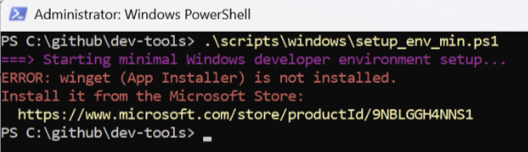

## Frequently Asked Questions

**Issue**
ERROR: winget (App Installer) is not installed.

**Solution**

1. Make sure if App Installer is properly configured in the `PATH` environment variable. Open the PowerShell and run `echo $env:PATH`. You should see something like `C:\Users\<yourname>\AppData\Local\Microsoft\WindowsApps`.
2. If you don't see the WindowsApp path, add it (in Powershell): `setx PATH $env:PATH;C:\Users\$env:USERNAME\AppData\Local\Microsoft\WindowsApps"`.
3. Restart the Powershell and run `winget --version`.
4. If you still see the issue the, download the installer for the latest version of App Installer from Microsoft website(https://learn.microsoft.com/en-us/windows/msix/app-installer/install-update-app-installer) and rerun the script.

Since this is a Windows application you didn't require admin rights to run it.

---

