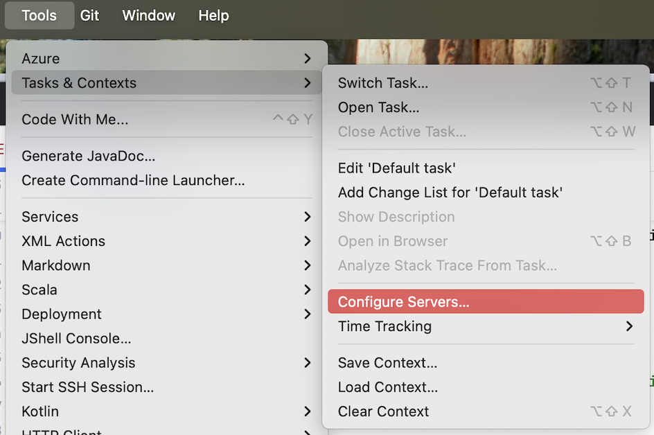

# 1. Developer Tools

I have been consistently using a series of commands for some time to reproduce a development environment across
various machines. For the most part, these commands were kept as gists. Recently, I managed to compile them all
into a primary shell script (along with optional secondary scripts) and a runcom (rc) file. I hope this proves helpful
to others!

> “On a UNIX system, everything is a file; if something is not a file, it is a process.” ― Machtelt Garrels,
> Introduction To Linux: A Hands-On Guide

## 1.1. Table of Contents

1. [Table of Contents](#11-table-of-contents)
2. [Setup Instructions](#12-setup-instructions)
    1. [Steps](#121-steps)
    2. [setup_env.sh](#122-setup_envsh)
    3. [Developer folder](#123-developer-folder)
    4. [git_setup.sh](#124-git_setupsh)
    5. [jenv_setup.sh](#125-jenv_setupsh)
    6. [dock_setup.sh](#126-dock_setupsh)
3. [Git](#14-git)
    1. [Pretty print all commits](#141-Pretty-print-all-commits)
    2. [List repository contributors by author name (sorted by name)](#142-List-repository-contributors-by-author-name)
    3. [List total commits by author (sorted by commit count)](#143-List-total-commits-by-author)
    4. [What changed since given date?](#144-What-changed-since-given-date)
    5. [List file change stats by author](#145-List-file-change-stats-by-author)
4. [Packages](#15-Packages)
5. [IntelliJ Tasks - GitHub Issue Integration](#16-intellij-tasks---github-issue-integration)
6. [TODO](#17-todo)
7. [Reference](#18-reference)

## 1.2. Setup Instructions

> ***Warning***
> 1. The script is tested on Apple M2/M3/M4 Pro (should also work on M1) and zsh shell.
> 2. Type `bash` and hit enter. If you see the error "Bash is required to interpret this script", change to `bash` shell
     as Homebrew install script uses bash.
> 3. If you haven't already installed Xcode Command Line Tools, you'll see a message that **The Xcode Command Line Tools
     will be installed.**

Check the output below to see if the Command Line Tools are installed:

```console
    ==> Searching online for the Command Line Tools
    ==> /usr/bin/sudo /usr/bin/touch /tmp/.com.apple.dt.CommandLineTools.installondemand.in-progress
    ==> Installing Command Line Tools for Xcode-15.3
    ==> /usr/bin/sudo /usr/sbin/softwareupdate -i Command\ Line\ Tools\ for\ Xcode-15.3
    Software Update Tool

    Finding available software

    Downloading Command Line Tools for Xcode
    Downloaded Command Line Tools for Xcode
    Installing Command Line Tools for Xcode

    Done with Command Line Tools for Xcode
```

### 1.2.1. Steps

1. If your Mac is **managed (work or school)** then try to get an admin account and switch user. For e.g. if the admin
   account is `Koadmin` then `su Koadmin` and enter the password for that account with higher privileges
2. Install [Homebrew](https://brew.sh/) (**Pre-requisite**)
3. Clone this repo: `git clone https://github.com/yaravind/dev-tools.git` or download as zip (**Pre-requisite**)
4. cd <kbd>dev-tools</kbd>
5. Make `setup_env.sh` executable: <kbd>chmod +x setup_env.sh jenv_setup.sh git_setup.sh gen_dock_apps.sh
   dock_setup.sh</kbd>
6. Run: <kbd>./setup_env.sh</kbd>
7. Copy `.zshrc` (or `.bashrc` based on your shell) to home directory: <kbd>cp .zshrc ~/</kbd> and run <kbd>source ~/.zshrc</kbd>
8. Run <kbd>./jenv_setup.sh</kbd> to add JDK
9. Run <kbd>./git_setup.sh</kbd> to setup Git Credentials
10. Run <kbd>./dock_setup.sh</kbd> to setup macOS Dock

> ***Warning (on macOS)***
>
> Your terminal does not have App Management permissions, so Homebrew will delete and reinstall the app.
> This may result in some configurations (like notification settings or location in the Dock/Launchpad) being lost.
> To fix this, go to System Settings > Privacy & Security > App Management and add or enable your terminal.

### 1.2.2. setup_env.sh

`set_env.sh` is the primary script and starting point that automates the installation and configuration of various
developer tools for Apple M1/M2 Pro. At a high level it will

- Disables the terminal login banner.
- Install developer command-line and other productivity tools (JDK compatible with M1/M2, Maven, Mamba, Conda, Python
  etc.).
- Install modern developer fonts.
- Install IntelliJ IDEA CE/Ultimate, PyCharm CE/Ultimate and VS Code.
- Set required environment variables.
- Verify and highlight the successful installation and configuration of the tools.
- Some notable tools include

**Installed productivity shell utils**

| Utility    | Usage                                                             |
|------------|-------------------------------------------------------------------|
| htop	      | Improved top (interactive process viewer)                         |
| tree	      | Display directories as trees (with optional color/HTML output)    |
| jq	        | Lightweight and flexible command-line JSON processor              |
| gh	        | GitHub command-line tool                                          |
| azure-cli	 |                                                                   |
| tldr	      | Simplified and community-driven man pages                         |
| graphviz	  | Convert dot files to images                                       |
| eza	       | A modern alternative to `ls`                                      |
| trash	     | Moves files to the trash, which is safer because it is reversible |
| jenv	      | Manage multiple versions of Java                                  |
| bat	       | Clone of cat(1) with syntax highlighting and Git integration      |
| thefuck	   | Programmatically correct last mistyped console command            |
| pandoc	    | Swiss-army knife of markup format conversion                      |
| lnav       | tool for viewing and analyzing log files                          |
| node       | JavaScript runtime environment                                    |
| llm        | Access large language models from the command-line                |

> Highly recommend this course if you are beginning your career as a software engineer:
> [Unix Tools: Data, Software and Production Engineering](https://www.edx.org/course/unix-tools-data-software-and-production-engineering)
> by Prof. Diomidis Spinellis.

### 1.2.3. Developer Folder

<kbd>mkdir ~/Developer</kbd>: It has a fancy icon in Finder!

### 1.2.4 git_setup.sh

`git_setup.sh` automates the configuration of Git user credentials. It prompts the user to input their name and email

### 1.2.5 jenv_setup.sh

`setp_jenv.sh` automates the process of adding Java Virtual Machine (JVM) installations to the `jenv` version manager on
a macOS system. Here is an overview of what the script does:

1. Uses `/usr/libexec/java_home --xml` to get XML output of the installed JVMs.
2. Parses the installation directories using `xmllint`
3. Adds the JVMs to `jenv` using `jenv add` command.
4. Lists the JVMs managed `jenv versions` command.

Use the following command to list the version, architecture, and folder location of all installed JVMs on your Mac:

<kbd>$ /usr/libexec/java_home --verbose<kbd>

Output:

```shell
Matching Java Virtual Machines (2):
    11.0.25 (arm64) "Microsoft" - "OpenJDK 11.0.25" /Library/Java/JavaVirtualMachines/microsoft-11.jdk/Contents/Home
    1.8.0_422 (arm64) "Amazon" - "Amazon Corretto 8" /Users/aravind/Library/Java/JavaVirtualMachines/corretto-1.8.0_422/Contents/Home
/Library/Java/JavaVirtualMachines/microsoft-11.jdk/Contents/Home

```

You can use the following commands to then enable specific JDK versions:

- Set Global version: <kbd>jenv global xx</kbd>
- Set Local version: <kbd>jenv local xx</kbd>. Local Java version for the current working directory. This will create a
  `.java-version` file we can check into Git for your projects

### 1.2.6 dock_setup.sh

`dock_setup.sh` automates the customization of the macOS Dock by adding commonly used applications and removing
default ones. The script uses the `dockutil` command-line utility to manage the Dock items. Here is an overview of what
the script does:

1. Customizes the settings of the Dock such as icon size, magnification, and auto-hide behavior.
2. Removes all existing applications from the Dock to start with a clean slate.
3. Adds a predefined list of preferred applications to the Dock (chrome, finder, vscode etc.) in a specific order.
4. Adds default folders to the right side of the Dock for easy access. The folders added are:
    1. Applications folder
    2. Documents folder
    3. Downloads folder
    4. Trash
5. Restarts the Dock to apply the changes immediately.

The Application names to be added to the Dock are read from `dock_apps.txt` file. It can be generated using the <kbd>
gen_dock_apps.sh</kbd> script. You can also manually create and edit the file by following the guidelines:

1. Create a new text file named `dock_apps.txt` in the same directory as the `dock_setup.sh` script.
2. Open the `dock_apps.txt` file in a text editor.
3. List the names of the applications you want to add to the Dock, one per line.
    1. Ensure that the names match the application names as they appear in the `/Applications` folder. You can
       right-click on an application in the Applications folder and select "Get Info" to see the exact name. If there is
       a space in the name, ensure to escape it with `\`. For e.g. `/Applications/Microsoft\ Teams.app`
    2. Include the file extension `.app` for each application name.
    3. If you want to add folders (like Documents or Downloads), you can include them as well, but make sure to specify
       the full path (e.g., `/Users/yourusername/Documents`).
    4. If you want to add system applications, you may need to provide the full path (e.g.,
       `/System/Applications/System Settings.app`).
    5. You can add a comment line starting with `--` to describe sections or provide context, but these lines will be
       ignored by the script.
    6. You use `SPACER` as a placeholder to add a spacer in the Dock.
    7. Example content of `dock_apps.txt`:

## 1.4. Git

Add the following aliases to `.bashrc`

```shell
alias gcfg='git config -l'
alias gs='git status '
alias ga='git add '
alias gb='git branch '
alias gc='git commit -m'
alias gca='git commit --amend -m'
alias gac='git add -A . && git commit -m'
alias gp='git push origin master'
alias gd='git diff'
alias go='git checkout '
alias gl='git log --pretty=format:"%C(yellow)%h%Cred%d\\ %Creset%s%Cblue\\ [%cn]" --decorate'
alias gsl='git shortlog'
alias gslu='git log --format='%aN' | sort -u'
alias gslc='git shortlog -sn'

gsu() { git log --shortstat --author="$1" | grep -E "fil(e|es) changed" | awk '{files+=$1; inserted+=$4; deleted+=$6; delta+=$4-$6; ratio=deleted/inserted} END {printf "Commit stats:\n- Files changed (total)..  %s\n- Lines added (total)....  %s\n- Lines deleted (total)..  %s\n- Total lines (delta)....  %s\n- Add./Del. ratio (1:n)..  1 : %s\n", files, inserted, deleted, delta, ratio }' - ;}

gw() { git whatchanged --since "$1" --oneline --name-only --pretty=format: | sort | uniq; }
```

##### 1.4.1. Pretty print all commits

```console
rishik@rishik-computer:~/ws/linux-cheatsheet$ gl
5e737fc (HEAD -> master)\ add examples for git commands\ [Aravind R. Yarram]
accef64 (origin/master, origin/HEAD)\ add exaples for find & locate\ [Aravind R. Yarram]
d592777\ add history command examples\ [Aravind R. Yarram]
46b5609\ add references\ [Aravind R. Yarram]
caa8be3\ add references\ [Aravind R. Yarram]
6c3afc4\ add TOC\ [Aravind R. Yarram]
6d72532\ add TOC\ [Aravind R. Yarram]
75d2fe9\ add examples for which and alias  commands\ [Aravind R. Yarram]
ff00092\ add examples for file command\ [Aravind R. Yarram]
f0b1593\ notes for file command\ [Aravind R. Yarram]
d4c2afb\ format content\ [Aravind R. Yarram]
3751b09\ add notes for Files\ [Aravind R. Yarram]
2617c7e\ Initial commit\ [GitHub]
```

##### 1.4.2. List repository contributors by author name

Output is sorted by name.

```console
rishik@rishik-computer:~/ws/linux-cheatsheet$ gslu
Aravind R Yarram
Aravind R. Yarram
```

##### 1.4.3. List total commits by author

Output is sorted by commit count.

```console
rishik@rishik-computer:~/ws/linux-cheatsheet$ gslc
    12  Aravind R. Yarram
     1  Aravind R Yarram
```

##### 1.4.4. What changed since given date?

```console
rishik@rishik-computer:~/ws/datasets$ gw 09/01/2018

computer/cpu-performance-data.csv
flight/2014_jan_carrier_performance.csv
.gitignore
machine-learning-a2z/Part 1 - Data Preprocessing/Data.csv
machine-learning-a2z/readme.txt
README.md
rishik@rishik-computer:~/ws/datasets$ gw "10/01/2018"

computer/cpu-performance-data.csv
flight/2014_jan_carrier_performance.csv
.gitignore
README.md
```

##### 1.4.5. List file change stats by author

```console
rishik@rishik-computer:~/ws/linux-cheatsheet$ gsu Aravind R. Yarram
Commit stats:
- Files changed (total)..  18
- Lines added (total)....  490
- Lines deleted (total)..  35
- Total lines (delta)....  455
- Add./Del. ratio (1:n)..  1 : 0.0714286
```

## 1.5. Packages

Reference: https://help.ubuntu.com/community/Repositories

`cat /etc/apt/sources.list` - lists all the repositories

`sudo apt update` - updates the package index cache
`sudo apt upgrade` - upgrades all packages to latest versions
`sudo apt upgrad <package-name>` - upgrades specified package to latest version

`apt-cache policy <package-name>` - lists the currently installed version and available versions
`apt-get install <package-name>=<version>` - install specific version of a package. get version from apt-cache policy
command
`apt-get install apache2=2.4.7-1ubuntu4.5`

apt-mark hold <package-name> - apt-mark allows you to pin the package to an installed ver. apt/apt-get upgrade doesn't
upgrade to latest

aptitude versions <package-name> - shows all the versions available

## 1.6. IntelliJ Tasks - GitHub Issue Integration

Configure IntelliJ to use GitHub Issues as a task manager. This allows you to create, view, and manage GitHub issues
directly.



## 1.7. TODO

- https://www.warp.dev/pricing
- https://www.cursor.com/
- https://lawand.io/taskbar/
- https://displaybuddy.app/
- https://github.com/sharkdp/vivid
- https://icemenubar.app/
- https://github.com/dmarcotte/easy-move-resize
- https://www.alfredapp.com/
- https://obsidian.md/
- cmd
    - https://github.com/junegunn/fzf

Disable .DS_Store files

`defaults write com.apple.desktopservices DSDontWriteNetworkStores true`
`defaults write com.apple.desktopservices DSDontWriteUSBStores -bool true`
`defaults write =com.apple.finder ShowPathbar -bool true` - It show the path on the bottom of finder when navigating
nested folder

## 1.8. Reference

- [Notes](notes.md)
- [The Linux Documentation Project](http://www.tldp.org/guides.html)
- [Stackoverflow](https://stackoverflow.com)
- [Git Gist](https://gist.github.com/eyecatchup/3fb7ef0c0cbdb72412fc)
- [Install custom logger formats for lnav](https://docs.lnav.org/en/latest/formats.html)