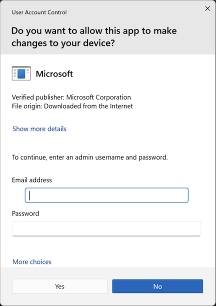

# Developer Tools

[](https://github.com/yaravind/dev-tools/actions/workflows/script-tests.yml)

📖 **Documentation:** [https://yaravind.github.io/dev-tools/](https://yaravind.github.io/dev-tools/)

> **One command to bootstrap a productive macOS and Windows environment for software and data engineering development. From a fresh machine to fully equipped in minutes.** ✨ Several scripts and configurations in this repository were meticulously crafted through vibe coding powered by GitHub Copilot and Google Gemini.

Setting up a new machine is tedious. Hunting down the right tools, configuring shells, managing Java versions, wiring up your IDE; it takes hours and rarely produces consistent results. This project captures battle-tested scripts and configs so you can reproduce a complete, opinionated developer environment on Apple Silicon (M1/M2/M3/M4) in one run.

## Features


| Benefit                  | Detail                                                                                         |
| ------------------------ | ---------------------------------------------------------------------------------------------- |
| ⚡**Fast bootstrap**     | Install and configure 30+ tools with a single command                                          |
| 🔁**Reproducible**       | Identical setup across every machine, every time                                               |
| 🧰**Curated toolset**    | Hand-picked CLI utilities, JVM toolchain, Python/Rust, LLM tools, and modern IDEs              |
| 🔧**Shell-ready**        | Pre-wired`.zshrc` with aliases, helpers, and prompt tweaks that survive reboots                |
| 📊**Data & ML friendly** | Includes`uv`, `mamba`, `conda`, Python, cloud CLIs, and `ollama` for local LLMs out of the box |

## Setup Instructions

### macOS (Apple Silicon M1/M2/M3/M4)

> ***Warning***
>
> 1. The script is tested on Apple M2/M3/M4 Pro (should also work on M1) and zsh shell.
> 2. Type `bash` and hit enter. If you see the error "Bash is required to interpret this script", change to `bash` shell
>    as Homebrew install script uses bash.
> 3. If you haven't already installed Xcode Command Line Tools, you'll see a message that **The Xcode Command Line Tools
>    will be installed.**

Check the output below to see if the Command Line Tools are installed:

```console
    ==> Searching online for the Command Line Tools
    ==> /usr/bin/sudo /usr/bin/touch /tmp/.com.apple.dt.CommandLineTools.installondemand.in-progress
    ==> Installing Command Line Tools for Xcode-15.3
    ==> /usr/bin/sudo /usr/sbin/softwareupdate -i Command\ Line\ Tools\ for\ Xcode-15.3
    Software Update Tool

    Finding available software

    Downloading Command Line Tools for Xcode
    Downloaded Command Line Tools for Xcode
    Installing Command Line Tools for Xcode

    Done with Command Line Tools for Xcode
```

#### Steps

1. If your Mac is **managed (work or school)** then try to get an admin account and switch user. For e.g. if the admin
   account is `Koadmin` then `su Koadmin` and enter the password for that account with higher privileges
2. Install [Homebrew](https://brew.sh/) (**Pre-requisite**)
3. Clone this repo: `git clone https://github.com/yaravind/dev-tools.git` or download as zip (**Pre-requisite**)
4. cd <kbd>dev-tools</kbd>
5. Make `setup_env.sh` executable: <kbd>chmod +x scripts/macos/setup_env.sh scripts/macos/jenv_setup.sh scripts/macos/git_setup.sh scripts/macos/gen_dock_apps.sh
   scripts/macos/dock_setup.sh</kbd>
6. Run: <kbd>./scripts/macos/setup_env.sh</kbd>
7. Copy `.zshrc` (or `.bashrc` based on your shell) to home directory: <kbd>cp config/.zshrc ~/</kbd> and run <kbd>source ~
   /.zshrc</kbd>
8. Run <kbd>./scripts/macos/jenv_setup.sh</kbd> to add JDK
9. Run <kbd>./scripts/macos/git_setup.sh</kbd> to setup Git Credentials
10. Run <kbd>./scripts/macos/dock_setup.sh</kbd> to setup macOS Dock

#### Minimal setup for Spark/Scala/Java development

A lightweight bootstrap script (`scripts/macos/setup_env_min.sh`) is available for getting a Spark/Scala/Java development environment up and running quickly, without the full suite of tools installed by `setup_env.sh`. It installs Git, a JDK, Maven, VS Code, and IntelliJ IDEA.

1. Install [Homebrew](https://brew.sh/) (**Pre-requisite**)
2. Clone this repo: `git clone https://github.com/yaravind/dev-tools.git` or download as zip (**Pre-requisite**)
3. cd <kbd>dev-tools</kbd>
4. Make the script executable: <kbd>chmod +x scripts/macos/setup_env_min.sh</kbd>
5. Run: <kbd>./scripts/macos/setup_env_min.sh</kbd>
6. Run <kbd>./scripts/macos/vscode_setup.sh</kbd> to install required (and some optional) VS Code extensions. The list is in `config/vscode.txt` if you prefer to add or remove extensions.
7. *(Optional)* Launch IntelliJ IDEA once to complete its first-run setup

> ***Warning (on macOS)***
>
> Your terminal does not have App Management permissions, so Homebrew will delete and reinstall the app.
> This may result in some configurations (like notification settings or location in the Dock/Launchpad) being lost.
> To fix this, go to System Settings > Privacy & Security > App Management and add or enable your terminal.

---

### Windows (10/11)

> ***Requirements***
>
> - Windows 10 (version 1809 or later) or Windows 11
> - [winget](https://learn.microsoft.com/en-us/windows/package-manager/winget/) (App Installer) — pre-installed on
>   Windows 11; available from the [Microsoft Store](https://www.microsoft.com/store/productId/9NBLGGH4NNS1) on
>   Windows 10
> - PowerShell 5.1 or later (PowerShell 7+ recommended)

#### Steps

1. Clone this repo: `git clone https://github.com/yaravind/dev-tools.git` or download as zip (**Pre-requisite**)
2. Open **PowerShell as Administrator**
3. Allow script execution for this session: <kbd>Set-ExecutionPolicy Bypass -Scope Process -Force</kbd>
4. cd <kbd>dev-tools</kbd>
5. Run: <kbd>./scripts/windows/setup_env.ps1</kbd>
6. Restart your terminal to apply PATH and environment variable changes
7. Run <kbd>./scripts/windows/jenv_setup.ps1</kbd> to register installed JDKs with [JEnv-for-Windows](https://github.com/FelixSelter/JEnv-for-Windows)
8. Run <kbd>./scripts/windows/git_setup.ps1</kbd> to set up Git credentials (name and email)

#### Minimal setup for Spark/Scala/Java development

A lightweight bootstrap script (`scripts/windows/setup_env_min.ps1`) is available for getting a Spark/Scala/Java development environment up and running quickly, without the full suite of tools installed by `setup_env.ps1`. It installs Git, a JDK, Maven, VS Code, and IntelliJ IDEA.

1. Clone this repo: `git clone https://github.com/yaravind/dev-tools.git` or download as zip (**Pre-requisite**)
2. Open **PowerShell as Administrator**
3. Allow script execution for this session: <kbd>Set-ExecutionPolicy Bypass -Scope Process -Force</kbd>
4. cd <kbd>dev-tools</kbd>
5. Run: <kbd>\.\scripts\windows\setup_env_min.ps1</kbd>
6. Restart your terminal to apply PATH and `JAVA_HOME` changes
7. Run <kbd>\.\scripts\windows\run_vscode_setup.ps1</kbd> to install required (and some optional) VS Code extensions. The list is in `config/vscode.txt` if you prefer to add or remove extensions.
8. *(Optional)* Launch IntelliJ IDEA once to complete its first-run setup

> Running the above script might open a popup like below for your approval. Select **Yes**.
> 

## Scripts


| Script Name                             | Description                                                                                                                                  |
| --------------------------------------- | -------------------------------------------------------------------------------------------------------------------------------------------- |
| `scripts/macos/setup_env.sh`            | Primary bootstrap script — installs and configures 30+ developer tools (JDK, Python, Rust, fonts, IDEs, shell utils) on macOS Apple Silicon |
| `scripts/macos/setup_env_min.sh`        | Minimal macOS bootstrap script for Git, JDK, Maven, VS Code, and IntelliJ IDEA                                                               |
| `scripts/macos/git_setup.sh`            | Configures global Git user credentials (name and email)                                                                                      |
| `scripts/macos/jenv_setup.sh`           | Discovers all installed JVMs and registers them with the`jenv` version manager                                                               |
| `scripts/windows/git_setup.ps1`         | Configures global Git user credentials (name and email) on Windows                                                                           |
| `scripts/windows/jenv_setup.ps1`        | Discovers all installed JDKs and registers them with[JEnv-for-Windows](https://github.com/FelixSelter/JEnv-for-Windows)                      |
| `scripts/macos/dock_setup.sh`           | Customizes the macOS Dock — sets icon size, removes defaults, and adds preferred apps from`config/dock_apps.txt`                            |
| `scripts/macos/gen_dock_apps.sh`        | Generates`config/dock_apps.txt` by reading the current Dock configuration                                                                    |
| `scripts/macos/vscode_setup.sh`         | Installs VS Code extensions listed in`config/vscode.txt`                                                                                     |
| `scripts/macos/conv-dot-to-png.sh`      | Converts`triples.dot` to a PNG image using Graphviz                                                                                          |
| `scripts/macos/colors.sh`               | Defines ANSI color code variables (sourced by other scripts)                                                                                 |
| `scripts/windows/setup_env.ps1`         | Primary bootstrap script — installs and configures tools using winget on Windows                                                            |
| `scripts/windows/setup_env_min.ps1`     | Minimal Windows bootstrap script for Git, JDK, Maven, VS Code, and IntelliJ IDEA                                                             |
| `scripts/windows/run_vscode_setup.ps1`  | Installs VS Code extensions listed in`config/vscode.txt` (runs `vscode_setup.ps1` with `-Yes`)                                               |
| `scripts/windows/run_taskbar_setup.ps1` | Pins/unpins Windows Taskbar apps from`config/taskbar_apps.txt`                                                                               |

---

For Git aliases, package management tips, IntelliJ integration, and more, see [DETAILS.md](DETAILS.md).

---

<div role="alert" style="border-left: 4px solid #d1242f; background-color: #fff5f5; padding: 12px 16px; margin: 16px 0; border-radius: 4px;">
  <strong>CAUTION</strong><br>
  <strong>Use at Your Own Risk.</strong> This project is provided as-is, without warranty of any kind, express or implied. By using these scripts and configurations, you accept full responsibility for any changes made to your system, including but not limited to software installation, configuration modifications, and system settings. The repository owner(s) and contributors shall not be held liable for any damage, data loss, security vulnerabilities, or other consequences arising from the use of this project. Always review scripts before executing them on your machine.
</div>
