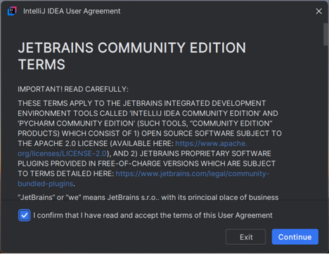
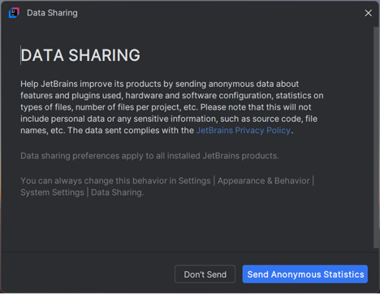
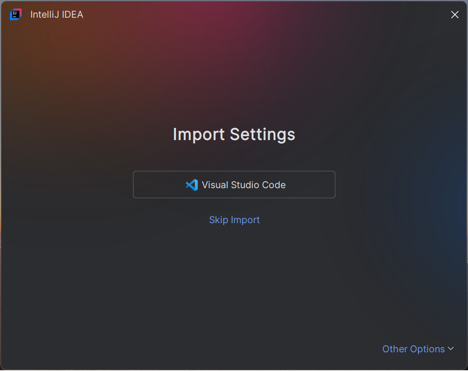
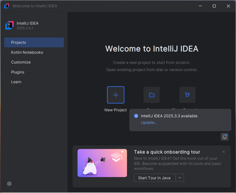
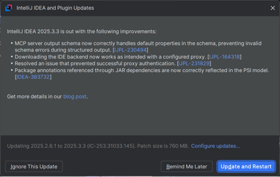
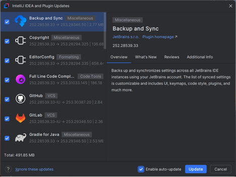
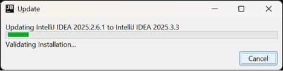
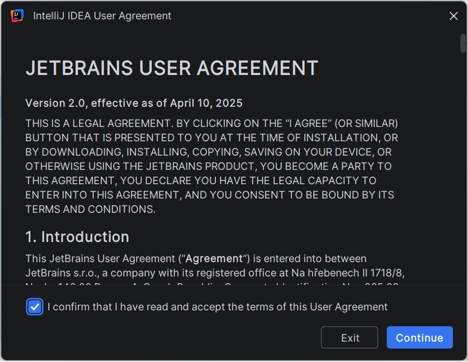

# IntelliJ IDEA Post Install Setup

> You don't need to install JDK on your machine explicitly. If you don't have one, you can download a JDK, such as Java 11, directly inside the **Project Structure** menu by navigating to `Project Settings | Project` and choosing `Download JDK`.

This page contains recommended steps post installation.

## Steps

Below are step-by-step screenshots and short instructions to help you finish post-install configuration. Images are listed in numeric order (1 → 9).

### Step 1 — Launch IntelliJ IDEA
Open IntelliJ IDEA from your Applications folder or Dock.

*Open the app to reach the Welcome screen.*

### Step 2 — Welcome Screen / Create New Project
From the Welcome screen, choose to create a new project or open an existing one.

*Create a new project or import an existing repository.*

### Step 3 — Select Project SDK / Language
When creating a project, select the desired SDK (JDK) and language/framework options.

*If no SDK is available, you can download one from the same dialog or set it later in Project Structure.*

### Step 4 — Configure Project Settings
Set project name, location, and additional settings as prompted.

*Choose sensible defaults for your workspace layout.*

### Step 5 — Project View / Tool Windows
Once the project loads, use the Project tool window to browse files and modules.

*Familiarize yourself with the Project, Structure, and Terminal panes.*

### Step 6 — Project Structure (SDKs & Modules)
Open `File → Project Structure` to verify or add SDKs and configure module settings.

*Add or switch SDKs here if your project requires a specific Java version.*

### Step 7 — Install Recommended Plugins
Install any necessary plugins (for example: Scala, Markdown, Database tools) via `Settings → Plugins`.

*Search and install plugins, then restart the IDE if prompted.*

### Step 8 — Version Control / Git Integration
Set up VCS roots or connect the project to Git from `VCS → Enable Version Control Integration`.

*Configure your Git user name/email once per machine in Preferences if not already set.*

### Step 9 — Run Configuration and Build
Create or run an existing Run/Debug configuration to build and run your application.

*Create a configuration for the main class or test target and verify it runs.*

## Recommended Plugins

- Scala
- Azure Toolkit for IntelliJ
- .ignore
- Markdown
- Database Tools (if you work with databases)
